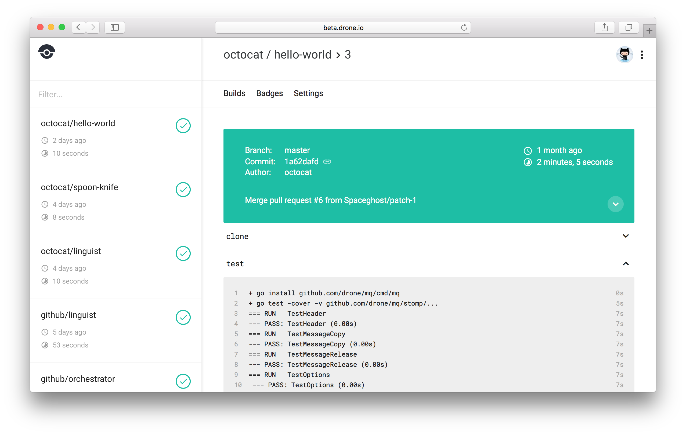

<h1 align= "center" style="margin-top: 5cm"> Drone.io: CI Server</h1>
<h3 align= "center" style="margin-top: 5cm"> By Julián Forero</h3>

---

## **Agenda**
1. ¿What is Drone?
2. Features
3. Interesting Things
   * Webhooks
   * Builds
   * Services
   * Promoting
   * Matrix
4. Integration
    * Source Code Admin
    * Plugins
5. Enterprise Edition

---

## **Drone.io**

*"Drone is a Continuous Delivery system built on container technology. Drone uses a simple YAML configuration file, a superset of docker-compose, to define and execute Pipelines inside Docker containers. "*

---

## Features

* Born in Containers. So much easier to test and deploy.

* You forgot about compatibility troubleshooting in terms of CI agents.

* Pipelines are code, so repeatability it's easier.

* Declarative, not imperative.

* Integration tests are easy. Just declare services.

* You don't have to worry about MySQL demons, Slave's labels, CI agents version, SDK, and so on.

* It handles every Docker Hub or Private Registry Image.

* You only need Docker. **That's all**.

---

---

## Webhooks

When you activate your repository Drone automatically add webhooks to your version control system (e.g. GitHub). There is no manual configuration required.

Webhooks are used to trigger pipeline executions. When you push code to your repository, open a pull request, or create a tag, your version control system will automatically send a webhook to Drone which will in turn trigger pipeline execution.

---

## Build

    pipeline:
      backend:
        image: golang
        commands:
         - go build
         - go test

The above commands are converted to a simple shell script. The commands in the above example are roughly converted to the below script:

    #!/bin/sh
    set -e
    go build
    go test

The above shell script is then executed as the docker entrypoint

    docker run --entrypoint=build.sh golang

---
###Parallel Execution

Drone supports parallel step execution for same-machine fan-in and fan-out. Parallel steps are configured using the group attribute.

    pipeline:
      backend:
    +   group: build
        image: golang
        commands:
          - go build
          - go test
      frontend:
    +   group: build
        image: node
        commands:
          - npm install
          - npm run test
          - npm run build
      publish:
        image: plugins/docker
        repo: octocat/hello-world

---
###Failure Execution

Drone uses the container exit code to determine the success or failure status of a build. Non-zero exit codes fail the build and cause the pipeline to immediately exit.

    pipeline:
      slack:
        image: plugins/slack
        channel: dev
    +   when:
    +     status: [ success, failure

---

##Services

Drone provides a services section in the Yaml file used for defining service containers.

    pipeline:
      build:
        image: golang
        commands:
          - go build
          - go test

    services:
      database:
        image: mysql

      cache:
        image: redis

Services are accessed using custom hostnames. In the above example the mysql service is assigned the hostname `database` and is available at `database:3306`

    mysql -u root -h tcp://database:3306

---

## Services

Service containers generally expose environment variables to customize service startup such as default usernames, passwords and ports

    services:
      database:
        image: mysql
    +   environment:
    +     - MYSQL_DATABASE=test
    +     - MYSQL_ALLOW_EMPTY_PASSWORD=yes

      cache:
        image: redis

---

## Promoting

Drone provides the ability to promote individual commits or tags (e.g. promote to production). When you promote a commit or tag it triggers a new pipeline execution with event type `deployment`. You can use the event type and target environment to limit step execution.

    pipeline:
      build:
        image: golang
        commands:
          - go build
          - go test

      publish:
        image: plugins/docker
        registry: registry.heroku.com
        repo: registry.heroku.com/my-staging-app/web
        when:
         event: deployment
         environment: staging

      publish_to_prod:
        image: plugins/docker
        registry: registry.heroku.com
        repo: registry.heroku.com/my-production-app/web
        when:
         event: deployment
         environment: production

---

## Matrix Builds

Drone has integrated support for matrix builds. Drone executes a separate build task for each combination in the matrix, allowing you to build and test a single commit against multiple configurations.

    matrix:
      GO_VERSION:
        - 1.4
        - 1.3
      REDIS_VERSION:
        - 2.6
        - 2.8
        - 3.0
---

## Matrix Builds

    pipeline:
      build:
        image: golang:${TAG}
        commands:
          - go build
          - go test

    matrix:
      TAG:
        - 1.7
        - 1.8
        - latest

---

### For testers:

    pipeline:
      build:
        image: ruby
        commands:
          - bundle exec rspec ${TESTFOLDER}

    matrix:
      TESTFOLDER:
        - integration/user
        - integration/shopping_cart
        - integration/payments
        - units

---

## Source Code Integration

 * **_GitHub_**
 * **_GitLab_**
 * **_Gitea_**
 * **_Gogs_**
 * **_Bitbucket Cloud_**
 * **_Bitbucket Server_**
 * **_Coding_**

---
## Plugins

There are around 50 plugins available to use in different scenarios:

* **_Messaging_**
  - Slack,Telegram, Line, Email, GTalk, Hipchat, Gitter
* **_AWS_**
  - S3, CloudFormation, ECR, ECS, Beanstalk.
* **_Docker_**
  - Docker, Rancher
* **_Cloud_**
  - Cloud Foundry Bluemix Cloud, Drone Kubernetes, Google Cloud.

And so on.

---

## Source Code Integration

* **_GitHub_**
* **_GitLab_**
* **_Gitea_**
* **_Gogs_**
* **_Bitbucket Cloud_**
* **_Bitbucket Server_**
* **_Coding_**

---
### Not everything are good news

* Although docs are "updated", the most interesting parts (Kubernetes, Heroku, ECS) are not.

* It's possible to create a cluster (?)

---

##Enterprise Expansion Pack

* Global Secrets File
* Global Secrets Endpoint
* Global Registries File
* Global Environment
* Global Webhooks
* Integrate Prometheus
* Integrate Vault
* Custom Policies

---

##Enterprise Expansion Pack

Really, really expensive.

---

<h2 align= "center" style="margin-top: 3cm"> Thank you</h3>
<h1 align= "center" style="margin-top: 1cm"> Questions?</h3>
